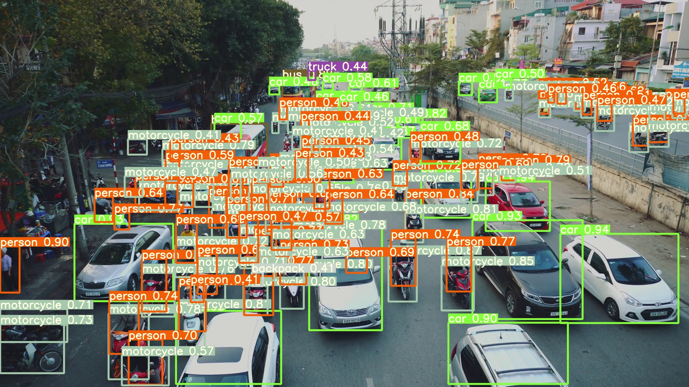

# YOLOR
implementation of paper - [You Only Learn One Representation: Unified Network for Multiple Tasks](https://arxiv.org/abs/2105.04206)

[](https://paperswithcode.com/sota/real-time-object-detection-on-coco?p=you-only-learn-one-representation-unified)

<!--  -->

<!--  -->

To reproduce the results in the paper, please use [this branch](https://github.com/WongKinYiu/yolor/tree/paper).

| Model | Test Size | AP<sup>test</sup> | AP<sub>50</sub><sup>test</sup> | AP<sub>75</sub><sup>test</sup> | AP<sub>S</sub><sup>test</sup> | AP<sub>M</sub><sup>test</sup> | AP<sub>L</sub><sup>test</sup> | batch1 throughput |
| :-- | :-: | :-: | :-: | :-: | :-: | :-: | :-: | :-: | 
| **YOLOR-P6** | 1280 | **52.6%** | **70.6%** | **57.6%** | **34.7%** | **56.6%** | **64.2%** | 49 *fps* |
| **YOLOR-W6** | 1280 | **54.1%** | **72.0%** | **59.2%** | **36.3%** | **57.9%** | **66.1%** | 47 *fps* |
| **YOLOR-E6** | 1280 | **54.8%** | **72.7%** | **60.0%** | **36.9%** | **58.7%** | **66.9%** | 37 *fps* |
| **YOLOR-D6** | 1280 | **55.4%** | **73.3%** | **60.6%** | **38.0%** | **59.2%** | **67.1%** | 30 *fps* |
|  |  |  |  |  |  |  |
| **YOLOv4-P5** | 896 | **51.8%** | **70.3%** | **56.6%** | **33.4%** | **55.7%** | **63.4%** | 41 *fps* |
| **YOLOv4-P6** | 1280 | **54.5%** | **72.6%** | **59.8%** | **36.6%** | **58.2%** | **65.5%** | 30 *fps* |
| **YOLOv4-P7** | 1536 | **55.5%** | **73.4%** | **60.8%** | **38.4%** | **59.4%** | **67.7%** | 16 *fps* |
|  |  |  |  |  |  |  |

To reproduce the inference speed, please see [darknet](https://github.com/WongKinYiu/yolor/tree/main/darknet).

| Model | Test Size | AP<sup>val</sup> | AP<sub>50</sub><sup>val</sup> | AP<sub>75</sub><sup>val</sup> | AP<sub>S</sub><sup>val</sup> | AP<sub>M</sub><sup>val</sup> | AP<sub>L</sub><sup>val</sup> | batch1 throughput |
| :-- | :-: | :-: | :-: | :-: | :-: | :-: | :-: | :-: | 
| [**YOLOv4-CSP**](/cfg/yolov4_csp.cfg) | 640 | **49.1%** | **67.7%** | **53.8%** | **32.1%** | **54.4%** | **63.2%** | 76 *fps* |
| [**YOLOR-CSP**](/cfg/yolor_csp.cfg) | 640 | **49.2%** | **67.6%** | **53.7%** | **32.9%** | **54.4%** | **63.0%** | [weights](https://drive.google.com/file/d/1ZEqGy4kmZyD-Cj3tEFJcLSZenZBDGiyg/view?usp=sharing) |
| [**YOLOR-CSP***](/cfg/yolor_csp.cfg) | 640 | **50.0%** | **68.7%** | **54.3%** | **34.2%** | **55.1%** | **64.3%** | [weights](https://drive.google.com/file/d/1OJKgIasELZYxkIjFoiqyn555bcmixUP2/view?usp=sharing) |
|  |  |  |  |  |  |  |
| [**YOLOv4-CSP-X**](/cfg/yolov4_csp_x.cfg) | 640 | **50.9%** | **69.3%** | **55.4%** | **35.3%** | **55.8%** | **64.8%** | 53 *fps* |
| [**YOLOR-CSP-X**](/cfg/yolor_csp_x.cfg) | 640 | **51.1%** | **69.6%** | **55.7%** | **35.7%** | **56.0%** | **65.2%** | [weights](https://drive.google.com/file/d/1L29rfIPNH1n910qQClGftknWpTBgAv6c/view?usp=sharing) |
| [**YOLOR-CSP-X***](/cfg/yolor_csp_x.cfg) | 640 | **51.5%** | **69.9%** | **56.1%** | **35.8%** | **56.8%** | **66.1%** | [weights](https://drive.google.com/file/d/1NbMG3ivuBQ4S8kEhFJ0FIqOQXevGje_w/view?usp=sharing) |
|  |  |  |  |  |  |  |

## Convert to ONNX

[`yolor_csp_x*`](https://drive.google.com/file/d/1NbMG3ivuBQ4S8kEhFJ0FIqOQXevGje_w/view?usp=sharing)

```
  python convert_to_onnx.py --weights yolor_csp_x_star.pt --cfg cfg/yolor_csp_x.cfg --output yolo_csp_x_star.onnx
```
```
  python object_detector_onnx.py
```
You will get the results:

## Convert to TensorRT
```
  /usr/src/tensorrt/bin/trtexec --onnx=yolor_csp_x_star.onnx \
                                --saveEngine=yolor_csp_x_star-fp16.trt \
                                --explicitBatch \
                                --minShapes=input:1x3x416x416 \
                                --optShapes=input:1x3x896x896 \
                                --maxShapes=input:1x3x896x896 \
                                --verbose \
                                --fp16 \
                                --device=0
```
```
  python object_detector_trt.py
```
Note that yolor_p6 have 4 detect layer, change maximum boxes in **exec_backends/trt_loader.py**
## Citation

```
@article{wang2021you,
  title={You Only Learn One Representation: Unified Network for Multiple Tasks},
  author={Wang, Chien-Yao and Yeh, I-Hau and Liao, Hong-Yuan Mark},
  journal={arXiv preprint arXiv:2105.04206},
  year={2021}
}
```

## Acknowledgements

<details><summary> <b>Expand</b> </summary>

* [https://github.com/AlexeyAB/darknet](https://github.com/AlexeyAB/darknet)
* [https://github.com/WongKinYiu/PyTorch_YOLOv4](https://github.com/WongKinYiu/PyTorch_YOLOv4)
* [https://github.com/WongKinYiu/ScaledYOLOv4](https://github.com/WongKinYiu/ScaledYOLOv4)
* [https://github.com/ultralytics/yolov3](https://github.com/ultralytics/yolov3)
* [https://github.com/ultralytics/yolov5](https://github.com/ultralytics/yolov5)

</details>
